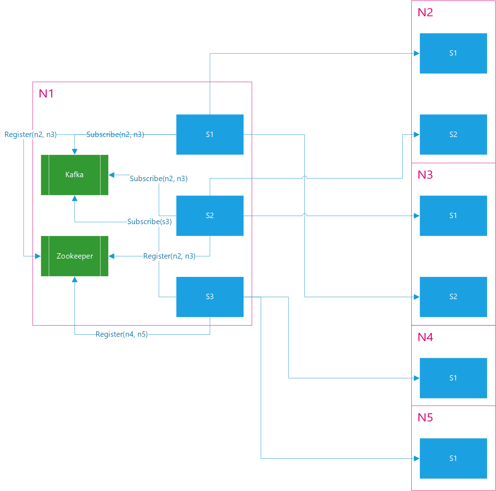

# P2P服务设计文档

## 需求说明

本方案应该满足的基本功能包括：

1. 支持两种基本操作：Broadcast（1-N）和Send（1-1）；
2. 支持在两个Node之间建立1至N条连接，每个P2P服务实例仅允许与对端建立1条连接，因此N不大于P2P服务集群的总实例个数。

## 术语和符号约定

在下文中，我们使用“节点/Node”来指代P2P网络中的一个逻辑节点，一个区块链运营者可能使用多台服务器来运行一个集群，但它们逻辑上是同一个节点；以“对端/Peer”来指代本地节点所连接的其他P2P节点。所有以`N1、N2、...`命名的都是一个逻辑节点，所有以`S1、S2、...`命名的都是一个节点内部的服务实例。

## 基本思路

以上需求包含两个维度：Broadcast/Send、1-1/1-X，这两个维度将应用场景切分为四个象限：

1. Broadcast + 1-1；
2. Broadcast + 1-X；
3. Send + 1-1；
4. Send + 1-X。

以下我们对四个场景下的实现方式逐一进行说明。

### Broadcast + 1-1

对于需要广播的消息，应用层会把它放入`p2p-broadcast` topic。对于一个P2P服务实例来说，如果它拥有一个1-1连接，那么它应该订阅这个topic，并且声明加入一个unique consumer group，例如，S1、S2两个P2P服务实例就可以分别使用`s1、s2`作为它们的group IDs，这样就能保证两个实例能够分别收到该topic的所有消息。

### Broadcast + 1-X

如果一个Node与对端存在一条以上的连接，那就意味着多个P2P服务实例应该以同一个consumer group消费广播消息，这样才能保证消息不会被重复发送。例如，S1和S2都拥有一条N1到N2的连接，那么S1和S2应该分别创建一个consumer，并使它加入`n2` group，这样，所有发往N2的消息都由这个consumer来处理，而不再使用`s1、s2`。

### Send + 1-1

当应用层需要主动向一个特定的Peer发送消息时，就会调用Send方法，这种场景并不适合通过Kafka作为中间件来传递，因为会造成带宽和处理资源的浪费，所以我们考虑使用RPC机制来实现。当N1节点上的S1与对端节点N2建立了连接后，它就会以N2的ID作为path向Zookeeper注册一个RPC服务，应用层在执行Send操作时，同样会以N2的ID作为path来查找是否存在可用的服务，这个过程是由rpcx框架内部支持的，因此相比自己来实现一套类似的机制更加方便。

### Send + 1-X

1-X的场景并不需要做额外的工作来支持，例如，S1和S2都拥有一条N1到N2的连接，那么它们就同样以N2的ID注册了一组服务，当应用层调用这个服务的接口时，rpcx框架会负责完成S1和S2之间的负载均衡。

以上所说的各种场景可以用下图表示：

图中包括4个P2P节点，我们以N1为中心说明上述实现的具体工作方式。

N1包含三个P2P服务实例S1、S2、S3，其中N1与N2、N3都建立了两个连接，与N4、N5都建立了一个连接，因此各个服务实例在Kafka和Zookeeper上的注册信息如下：

* Kafka：S1和S2都属于consumer group n2和n3，因此他们将分享p2p-broadcast topic；S3连接的S4和S5都是1-1连接，因此它只需要声明属于自己的s3 consumer group；

* Zookeeper：S1、S2、S3都分别将自己连接的对端节点ID注册到Zookeeper，rpcx框架会使用Zookeeper上的注册信息完成路由。

## 实施步骤

按照以上的实现思路，我们大体可以将一个完整的P2P服务实现分解成以下几部分：

* P2P Basic Function：管理一组连接，订阅广播消息实现Broadcast，注册RPC服务并响应Send请求；

* P2P Client：实现一组P2P客户端接口，使应用层可以在不感知P2P集群具体实现的情况下使用P2P服务；

* Peer Management：包含Coordinator和Executor两个角色，Coordinator负责为各个P2P服务实例分配连接地址并管理连接数，Executor响应Coordinator的控制命令并定期报告自己的连接状态。

现阶段我们会优先完成前两个部分，Peer Management的功能复杂且相对独立，可留待下一阶段完成，暂时使用静态配置文件代替。

观察上面的图示我们还可以发现，在上述场景下，S1和S2连接的都是同一组Peers（N2和N3），在这种情况下，实际上同时创建两个consumer group n2和n3不仅不必要，而且还会造成带宽的浪费。在这种场景下，如何规划和分配连接，如何最合理的订阅和消费消息是Peer Management的核心功能之一。后续要实现的自组织、PEX等功能也和这部分密切相关，因此Peer Management的终极形态可能比P2P本身还要复杂，这都需要在后续的工作中逐步实现。
